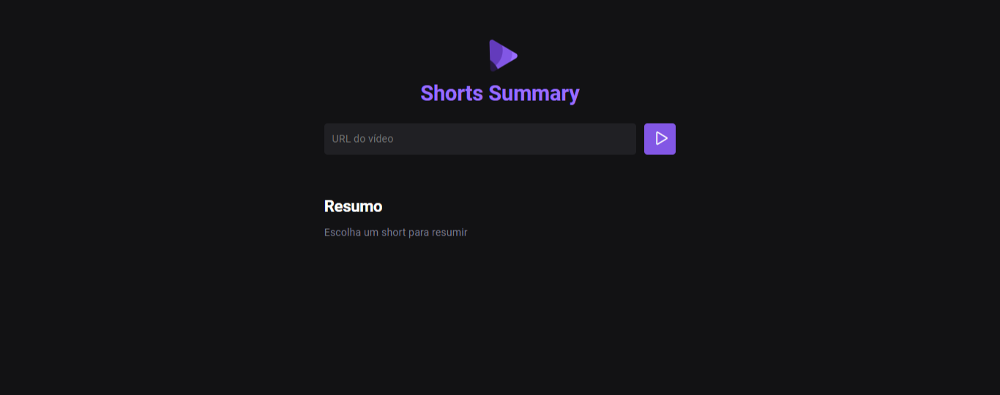

---

# Aplicação de Resumo de Conteúdo com Inteligência Artificial!

## Descrição
Esta é uma aplicação que permite realizar a transcrição e o resumo de informações através do modelo de inteligência artificial 
a partir de vídeos do shorts do YouTube.A aplicação consiste em duas partes: um servidor Node.js que disponibiliza uma API para transcrição e resumo, 
e um cliente web em JavaScript que interage com essa API.




## Conteúdo

1. [Servidor](#servidor)
2. [Cliente Web](#cliente-web)

## Servidor

### Tecnologias Utilizadas
- Node.js
- Express
- ytdl-core
- fluent-ffmpeg
- node-wav
- ffmpeg-static
- cors

### Estrutura do Servidor

O servidor Node.js utiliza o framework Express para fornecer uma API com os seguintes endpoints:

- `GET /summary/:id`: Baixa o áudio de um vídeo do YouTube, realiza a transcrição e retorna o resultado.
- `POST /summary`: Recebe um texto e realiza o resumo, retornando o resultado.

#### Como Iniciar o Servidor
```bash
# Instalar dependências
npm install

# Iniciar o servidor
npm start
```

## Cliente Web

### Tecnologias Utilizadas
- JavaScript (ES6+)
- HTML
- CSS

### Estrutura do Cliente Web

O cliente web interage com a API do servidor para obter transcrições e realizar o resumo. Ele utiliza a biblioteca `axios` para fazer requisições HTTP.

#### Como Iniciar o Cliente Web
1. Abra o arquivo `index.html` em um navegador web.

### Como Utilizar

1. Acesse a aplicação através do cliente web.
2. Insira um link de vídeo do YouTube no formato "shorts" no campo de entrada.
3. Clique no botão de submissão.
4. Aguarde enquanto o sistema realiza o download, transcrição e resumo do conteúdo.
5. O resultado final será exibido na interface.

## Contribuições
Contribuições são bem-vindas! Sinta-se à vontade para abrir issues, pull requests ou fornecer feedback.

## Licença
Este projeto está licenciado sob a [Licença MIT](LICENSE).

---

